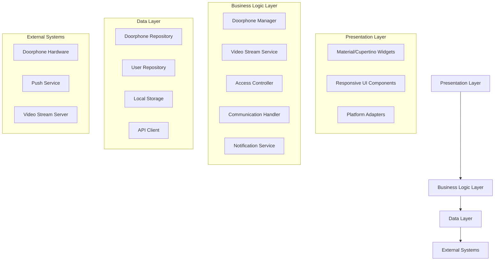

# Design Document

## Overview

The Flutter doorphone viewer application will initially focus on Android platform development, providing a native Android interface for monitoring and controlling doorphone systems. The application will leverage Flutter's capabilities while implementing Android-specific optimizations for video streaming, push notifications, and native integrations.

The architecture follows a layered approach with clear separation between the presentation layer (UI), business logic layer (services), and data layer (repositories and external integrations). This design ensures maintainability, testability, and provides a solid foundation for future cross-platform expansion to iOS, web, and Ubuntu desktop platforms.

## Architecture

### High-Level Architecture



### Platform-Specific Considerations

**Primary Focus - Android**:
- Material Design 3 components and theming
- Android-specific push notifications via Firebase Cloud Messaging (FCM)
- Camera and microphone permissions handling
- Background processing and battery optimization
- Android lifecycle management
- Deep linking for doorphone notifications
- Android-specific video codecs and streaming optimizations

**Future Platform Support** (foundation prepared):
- iOS: Cupertino design patterns, APNs for push notifications
- Web: Responsive design, WebRTC for video streaming
- Ubuntu: Desktop UI patterns, system notifications

## Components and Interfaces

### Core Services

#### DoorphoneManager
```dart
abstract class DoorphoneManager {
  Future<void> initializeAWSIoT(String endpoint, String certificatePath);
  Stream<DoorphoneDevice> get devices;
  Future<void> connectToDevice(String deviceId);
  Future<void> disconnectFromDevice(String deviceId);
  Future<List<DoorphoneEvent>> getEventHistory();
  Future<void> subscribeToMQTTTopic(String topic);
  Future<void> publishMQTTMessage(String topic, Map<String, dynamic> message);
}
```

#### VideoStreamService
```dart
abstract class VideoStreamService {
  Future<void> initializeKVSWebRTC(String channelName);
  Stream<VideoFrame> getVideoStream(String deviceId);
  Future<void> startWebRTCStream(String deviceId);
  Future<void> stopWebRTCStream(String deviceId);
  Stream<StreamQuality> get qualityMetrics;
  Future<void> sendWebRTCOffer(String deviceId);
  Future<void> handleWebRTCAnswer(String deviceId, String answer);
}
```

#### AccessController
```dart
abstract class AccessController {
  Future<void> unlockDoor(String deviceId);
  Future<void> lockDoor(String deviceId);
  Future<bool> checkDoorStatus(String deviceId);
  Stream<AccessEvent> get accessEvents;
}
```

#### CommunicationHandler
```dart
abstract class CommunicationHandler {
  Future<void> startWebRTCCall(String deviceId);
  Future<void> endWebRTCCall(String deviceId);
  Future<void> muteAudio(bool mute);
  Future<void> handleWebRTCSignaling(String deviceId, Map<String, dynamic> signalingData);
  Stream<CallState> get callState;
  Stream<Map<String, dynamic>> get webrtcSignalingEvents;
}
```

### Platform Adapters

#### NotificationAdapter
```dart
abstract class NotificationAdapter {
  Future<void> initialize();
  Future<void> showDoorbellNotification(DoorbellEvent event);
  Future<void> requestPermissions();
  Stream<NotificationResponse> get notificationStream;
}
```

#### PlatformUIAdapter
```dart
abstract class PlatformUIAdapter {
  Widget buildVideoPlayer(VideoStream stream);
  Widget buildControlPanel(List<ControlAction> actions);
  ThemeData getTheme();
  EdgeInsets getSafeAreaInsets();
}
```

#### AWSIoTService
```dart
abstract class AWSIoTService {
  Future<void> initialize(String endpoint, String certificatePath, String privateKeyPath);
  Future<void> connect();
  Future<void> disconnect();
  Future<void> subscribe(String topic, Function(String, Map<String, dynamic>) callback);
  Future<void> publish(String topic, Map<String, dynamic> message);
  Stream<MQTTConnectionState> get connectionState;
}
```

#### KVSWebRTCService
```dart
abstract class KVSWebRTCService {
  Future<void> initialize(String channelName, String region);
  Future<void> createSignalingChannel(String channelName);
  Future<void> connectAsViewer(String channelName);
  Future<void> sendOffer(Map<String, dynamic> offer);
  Future<void> sendAnswer(Map<String, dynamic> answer);
  Future<void> sendIceCandidate(Map<String, dynamic> candidate);
  Stream<Map<String, dynamic>> get signalingMessages;
  Stream<VideoFrame> get videoStream;
}
```

## Data Models

### Core Models

```dart
class DoorphoneDevice {
  final String id;
  final String name;
  final String ipAddress;
  final String kvsChannelName;
  final String mqttTopic;
  final String awsRegion;
  final DeviceStatus status;
  final List<String> capabilities;
  final DateTime lastSeen;
}

class DoorbellEvent {
  final String id;
  final String deviceId;
  final DateTime timestamp;
  final EventType type;
  final String? visitorImage;
  final Duration? callDuration;
}

class VideoFrame {
  final Uint8List data;
  final int width;
  final int height;
  final VideoFormat format;
  final DateTime timestamp;
}

class AccessEvent {
  final String id;
  final String deviceId;
  final String userId;
  final AccessAction action;
  final DateTime timestamp;
  final bool success;
}

class UserPermission {
  final String userId;
  final String deviceId;
  final List<Permission> permissions;
  final DateTime? expiresAt;
}
```

### Enums and Constants

```dart
enum DeviceStatus { online, offline, connecting, error }
enum EventType { doorbell, motion, access, call }
enum AccessAction { unlock, lock, deny }
enum Permission { view, unlock, manage, admin }
enum VideoFormat { h264, mjpeg, webrtc }
enum CallState { idle, ringing, active, ended }
enum MQTTConnectionState { disconnected, connecting, connected, error }
enum WebRTCSignalingState { idle, connecting, connected, failed }
```

## Correctness Properties

*A property is a characteristic or behavior that should hold true across all valid executions of a system-essentially, a formal statement about what the system should do. Properties serve as the bridge between human-readable specifications and machine-verifiable correctness guarantees.*
### Property Reflection

After reviewing all testable properties from the prework analysis, I've identified several areas where properties can be consolidated to eliminate redundancy:

- Properties 1.1-1.4 (platform build tests) are all examples of the same build validation pattern
- Properties 2.3, 2.4 can be combined into a single platform-specific input handling property
- Properties 3.1, 3.2, 3.3 can be consolidated into a comprehensive doorphone operation property
- Properties 5.1, 5.3 both relate to event handling and can be combined
- Properties 6.1, 6.3, 6.4 all relate to system reliability and can be consolidated

### Correctness Properties

Property 1: Android functionality consistency
*For any* core doorphone operation (video streaming, access control, communication), the Android implementation should produce consistent and reliable results
**Validates: Requirements 1.5, 2.5, 4.2**

Property 2: Android input handling
*For any* user touch input or gesture, the Android app should respond appropriately according to Material Design guidelines and Android conventions
**Validates: Requirements 2.1**

Property 3: Doorphone operation reliability
*For any* doorphone device and any valid operation (video stream request, unlock command, audio call), the system should execute the operation and provide appropriate feedback
**Validates: Requirements 3.1, 3.2, 3.3**

Property 4: Notification delivery consistency
*For any* doorbell event, all registered devices should receive push notifications, and the event should be logged in the system history
**Validates: Requirements 3.4, 5.1, 5.3**

Property 5: Multi-device management
*For any* set of configured doorphone devices, switching between devices should correctly change the active video stream and maintain independent device states
**Validates: Requirements 5.2**

Property 6: Offline synchronization
*For any* events that occur while offline, when connectivity is restored, all cached events should be synchronized with the server without data loss
**Validates: Requirements 5.4**

Property 7: Permission enforcement
*For any* user with specific permission levels, access to doorphone functions should be restricted according to their assigned permissions
**Validates: Requirements 5.5**

Property 8: System reliability
*For any* system startup, network error, or connectivity change, the application should handle the situation gracefully within reasonable time limits and provide appropriate user feedback
**Validates: Requirements 6.1, 6.3, 6.4**

Property 9: UI responsiveness
*For any* screen size or orientation change, the responsive UI should adapt video display and control layouts to maintain usability
**Validates: Requirements 3.5**

## Error Handling

### Network Error Handling
- Connection timeouts: Implement exponential backoff retry mechanism
- Video stream interruptions: Automatic reconnection with quality degradation fallback
- API failures: Graceful degradation with cached data when possible
- Offline mode: Queue operations for later synchronization

### Device Error Handling
- Doorphone device offline: Clear visual indicators and fallback to cached status
- Camera access denied: Appropriate permission request flows per platform
- Audio system errors: Fallback to visual notifications and text communication
- Hardware failures: Error reporting and alternative access methods

### Platform-Specific Error Handling
**Android-Focused Error Handling**:
- Background restrictions and battery optimization (Doze mode, App Standby)
- Android permission system (runtime permissions for camera/microphone)
- Network security policy restrictions
- Android lifecycle management (onPause, onResume, onDestroy)
- FCM token refresh and notification delivery failures
- Android-specific video codec compatibility issues

**Future Platform Considerations**:
- iOS: App lifecycle and background processing limitations
- Web: Browser compatibility and security restrictions
- Ubuntu: System permissions and desktop integration

## Testing Strategy

### Dual Testing Approach

The application will implement both unit testing and property-based testing to ensure comprehensive coverage:

**Unit Testing**:
- Specific examples demonstrating correct Android behavior
- Integration points between services and Android platform adapters
- Edge cases for network connectivity and device states
- Android-specific error condition handling and recovery mechanisms
- FCM notification handling and permission flows

**Property-Based Testing**:
- Universal properties that should hold across all inputs on Android
- Android-specific functionality verification
- Resource management and performance characteristics on Android devices
- Security and permission enforcement for Android platform

### Property-Based Testing Implementation

**Framework**: We will use the `test` package with custom property-based testing utilities for Dart/Flutter, implementing generators for doorphone devices, user permissions, and network states.

**Configuration**: Each property-based test will run a minimum of 100 iterations to ensure statistical confidence in the results.

**Test Tagging**: Each property-based test will be tagged with comments explicitly referencing the correctness property from this design document using the format: '**Feature: cross-platform-flutter-app, Property {number}: {property_text}**'

**Implementation Requirements**:
- Each correctness property will be implemented by a single property-based test
- Tests will generate random but valid input data for comprehensive coverage
- Platform-specific behavior will be tested through abstracted interfaces
- Performance and resource usage will be monitored during property test execution

### Testing Infrastructure

**Test Data Generation**:
- Random doorphone device configurations
- Various user permission combinations
- Network state simulations (online, offline, poor connectivity)
- Different screen sizes and orientations

**Platform Testing**:
- Automated testing on Android emulators
- iOS simulator testing for Cupertino compliance
- Web browser testing across Chrome, Firefox, Safari
- Ubuntu desktop testing with different window managers

**Integration Testing**:
- End-to-end doorphone communication flows
- Multi-device synchronization scenarios
- Push notification delivery verification
- Video streaming quality and performance testing

## Implementation Considerations

### Performance Optimization
- Video stream buffering and adaptive quality
- Efficient memory management for continuous operation
- Background processing limitations per platform
- Battery usage optimization for mobile platforms

### Security Considerations
- Encrypted communication channels for all doorphone data
- Secure storage of user credentials and device configurations
- Permission-based access control with proper validation
- Network security for video streaming and control commands

### Scalability
- Support for multiple doorphone devices per user
- Multi-user access with different permission levels
- Cloud synchronization for settings and event history
- Efficient data structures for large event histories

### Accessibility
- Screen reader support for visually impaired users
- High contrast mode support
- Keyboard navigation for all functions
- Voice control integration where available

### Internationalization
- Multi-language support for UI text
- Localized date/time formatting
- Right-to-left language support
- Cultural considerations for notification patterns